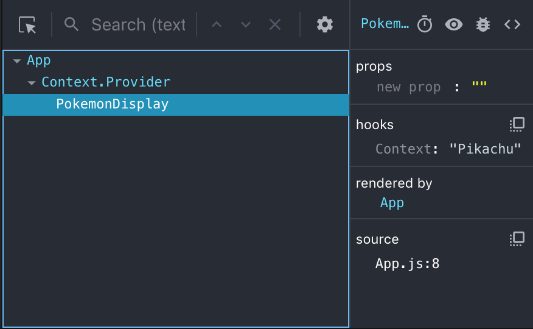
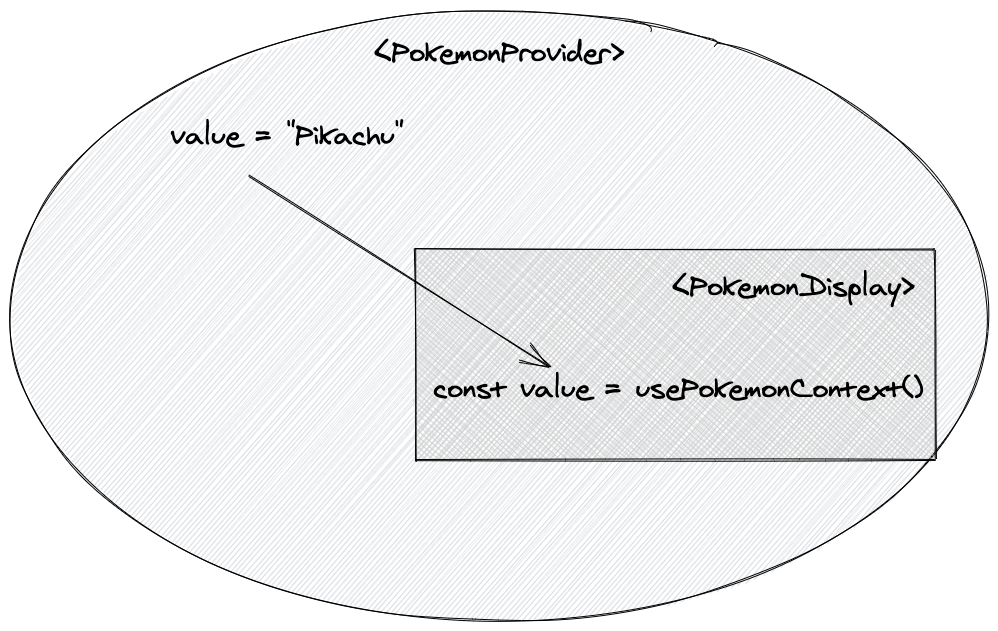

If you're like me, hooks are still a thing that you hear about but don't actively use at work. Regardless, I never used the Context API pre-hooks and so I had to learn the mental model in both implementations before it clicked with me. I am here to help you out so you can add to your list of skills!

## So what is Context?

As the React documentation puts it:

> '_Context provides a way to pass data through the component tree without having to pass
> props down manually every level._'

It is a way to share values into all of the components who are listening! This is incredibly **powerful**. You might think to yourself, "Why would I use anything but context then?" Well the big gotcha is that anything that is paying attention to this context will be fed new data as a prop which causes our component to rerender!

We'll go through a small example to align on what the API can do and what tools there are. If you already know some stuff about Context, I encourage you to get a refresher. However, I left the end to have some nice ways to spruce up your developer experience!

## React.createContext

To begin using your context, you will need to first create a context. This will return an object which has two very important things inside of it, a `Provider` and a `Consumer`!

```jsx
import React from 'react'

// This is how we will create our context.
// The method can take in an optional argument
// representing the defaultValue of the Context

const PokemonContext = React.createContext()
// {
//   Provider: Object,
//   Consumer: Object,
//   ... ~~Other stuff~~
// }
```

## Provider

Now that we have the context, let's talk about the `Provider`. This is the tool that will hold whatever data we want to be made available in its children. The data comes from a prop named `value`.

```jsx{7,9}
import React from 'react'

const PokemonContext = React.createContext()

export default function App() {
  return (
    <PokemonContext.Provider value={'Pikachu'}>
      <PokemonDisplay />
    </PokemonContext.Provider>
  )
}

function PokemonDisplay() {
  return <p>Who's that Pokemon?</p>
}
```

The value could be whatever we want: a string, a number, or even an object! In our case, we have `'Pikachu'` being the value sent down to all `PokemonContext.Provider`'s children.

## useContext (aka Consumer)

In order for any children to understand what is happening with the `Provider` though, we have to finally tell our component to listen. The way we do that is to `useContext`. This informs the component to subscribe to the context we pass in as an argument. We can then retrieve the value being sent through context as the return value of `useContext`. You can think of this as the way that the component **consumes** the context.

```jsx{1,14-15}
import React, { useContext } from 'react'

const PokemonContext = React.createContext()

export default function App() {
  return (
    <PokemonContext.Provider value={'Pikachu'}>
      <PokemonDisplay />
    </PokemonContext.Provider>
  )
}

function PokemonDisplay() {
  const value = useContext(PokemonContext)
  return <p>Who's that Pokemon? {value}</p>
}
```

You can also see it inside of the React DevTools that we have access to the context:



## Improving Developer Experience

In our current example, we have all the context declaration inside of our `App.jsx` but it would be better to isolate our work, to _separate our concerns_ if I may. I tend to lean on the side of creating a separate file and only exposing the data I want the developer using this to have access to:

```jsx
// In `pokemon-context.js`
import React from 'react'

// We're currently exposing our PokemonContext
const PokemonContext = React.createContext()

// We're exposing a custom provider that just has our value encapsulated.
// It can only be changed by ways we allow
function PokemonProvider(props) {
  return (
    <PokemonContext.Provider value={'Pikachu'}>
      {props.children}
    </PokemonContext.Provider>
  )
}

export { PokemonContext, PokemonProvider }
```

```jsx{4,8-10}
// In `App.jsx`

import React, { useContext } from 'react'
import { PokemonProvider, PokemonContext } from './pokemon-context'

export default function App() {
  return (
    <PokemonProvider>
      <PokemonDisplay />
    </PokemonProvider>
  )
}

function PokemonDisplay() {
  const value = useContext(PokemonContext)
  return <p>Who's that Pokemon? {value}</p>
}
```

If we want to get even better, we can make a custom hook! This way we would have no need for exposing our context object whatsoever! This is also nice because now we can error handle and say if you're using our context hook outside of a component who isn't a descendant to our `PokemonProvider`, then throw an error.

```jsx{17-23,25}
// In `pokemon-context.js`
import React from 'react'

// No longer exposing our context
const PokemonContext = React.createContext()

// We're exposing a provider that just has our value which
// is unchangeable from the outside.
function PokemonProvider(props) {
  return (
    <PokemonContext.Provider value={'Pikachu'}>
      {props.children}
    </PokemonContext.Provider>
  )
}

function usePokemonContext() {
  const context = React.useContext(PokemonContext)
  if (context === undefined) {
    throw new Error('usePokemonContext must be used within a PokemonProvider')
  }
  return context
}

export { usePokemonContext, PokemonProvider }
```

```jsx{2,3,14}
// In `App.jsx`
import React from 'react'
import { PokemonProvider, usePokemonContext } from './pokemon-context'

export default function App() {
  return (
    <PokemonProvider>
      <PokemonDisplay />
    </PokemonProvider>
  )
}

function PokemonDisplay() {
  const value = usePokemonContext()
  return <p>Who's that Pokemon? {value}</p>
}
```

Not every time will you use a `useContext` hook outside of its `Provider` but this creates a helpful error in the console for our developer.

## Conclusion

If you want a visualization of what we talked about:



We discussed how our Provider threads our value down to any component that is consuming it through the `useContext` hook which we wrapped around with our own custom hook `usePokemonContext`. Now we can extract the value `'Pikachu'` and in our case display it to the page!

This was a quick runthrough about how to get you familiar with what there is with the Context API. I hope that it helps you understand a bit more! Feel free to tweet at me and tell me how you're using the Context API! Sometimes Context won't be the right tool for the job and you can read about [Application State Management with React](https://kentcdodds.com/blog/application-state-management-with-react) by Kent C. Dodds to give you more insights about that.
